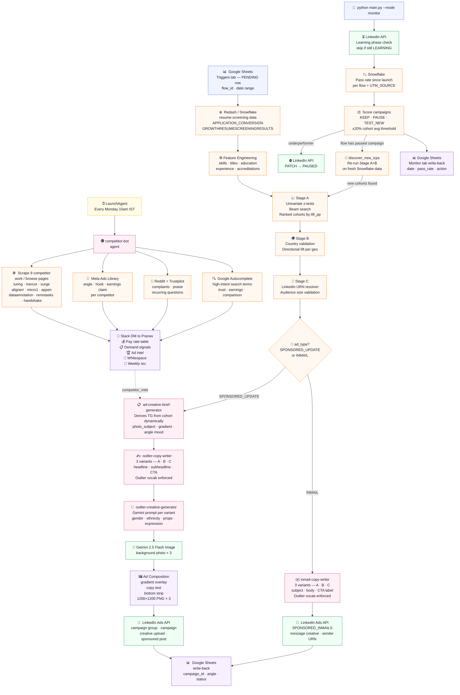
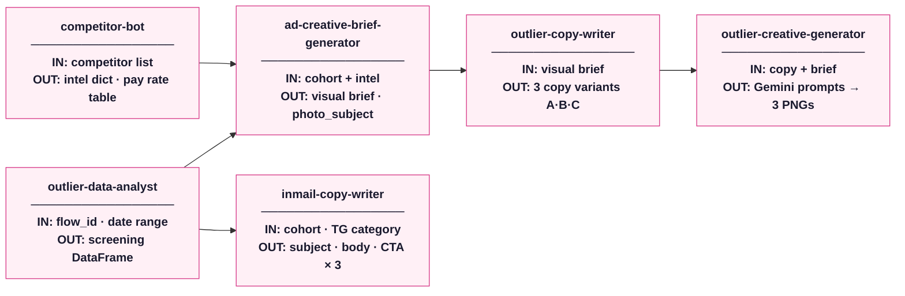
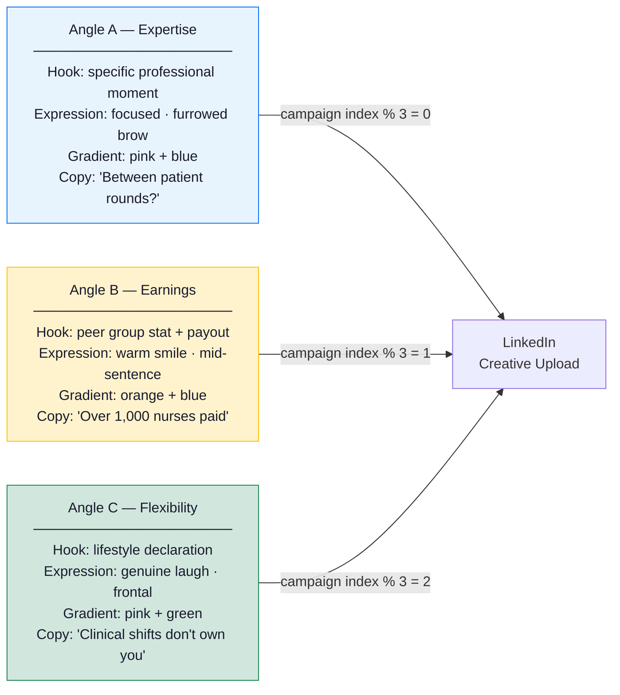

# Outlier LinkedIn Ad Campaign — System Workflow

---

## Full Pipeline

```mermaid
flowchart TD
    classDef trigger fill:#f0f4ff,stroke:#4a6cf7,color:#1a1a2e
    classDef agent fill:#fff0f6,stroke:#d63384,color:#1a1a2e
    classDef api fill:#f0fff4,stroke:#198754,color:#1a1a2e
    classDef data fill:#fff8f0,stroke:#fd7e14,color:#1a1a2e
    classDef output fill:#f8f0ff,stroke:#6f42c1,color:#1a1a2e
    classDef cron fill:#fffbe6,stroke:#ffc107,color:#1a1a2e

    %% ── WEEKLY INTEL LOOP ──────────────────────────────────────────
    CRON["⏰  LaunchAgent\nEvery Monday 10am IST"]:::cron
    BOT["🕵️  competitor-bot\nagent"]:::agent
    SCRAPE["🌐  Scrape 9 competitor\nwork / browse pages\nturing · mercor · surge\nalignerr · micro1 · appen\ndataannotation · remotasks · handshake"]:::data
    ADS["📣  Meta Ads Library\nangle · hook · earnings claim\nper competitor"]:::data
    REVIEWS["💬  Reddit + Trustpilot\ncomplaints · praise\nrecurring questions"]:::data
    SEO["🔍  Google Autocomplete\nhigh-intent search terms\ntrust · earnings · comparison"]:::data
    SLACK["📲  Slack DM to Pranav\n💰 Pay rate table\n📋 Demand signals\n🏆 Ad intel\n🎯 Whitespace\n📌 Weekly rec"]:::output

    CRON --> BOT
    BOT --> SCRAPE & ADS & REVIEWS & SEO
    SCRAPE & ADS & REVIEWS & SEO --> SLACK

    %% ── MAIN CAMPAIGN PIPELINE ─────────────────────────────────────
    SHEETS["📊  Google Sheets\nTriggers tab — PENDING row\nflow_id · date range"]:::trigger
    SNOW["❄️  Redash / Snowflake\nresume screening data\nAPPLICATION_CONVERSION\nGROWTHRESUMESCREENINGRESULTS"]:::data
    FEAT["⚙️  Feature Engineering\nskills · titles · education\nexperience · accreditations"]:::data

    STAGEA["📈  Stage A\nUnivariate z-tests\nBeam search\nRanked cohorts by lift_pp"]:::data
    STAGEB["🌍  Stage B\nCountry validation\nDirectional lift per geo"]:::data
    STAGEC["🎯  Stage C\nLinkedIn URN resolver\nAudience size validation"]:::data

    ADTYPE{"🔀  ad_type?\nSPONSORED_UPDATE\nor INMAIL"}:::data

    BRIEF["📋  ad-creative-brief-generator\nDerives TG from cohort dynamically\nphoto_subject · gradient · angle mood"]:::agent
    COPY["✍️  outlier-copy-writer\n3 variants — A · B · C\nheadline · subheadline · CTA\nOutlier vocab enforced"]:::agent
    DESIGN["🎨  outlier-creative-generator\nGemini prompt per variant\ngender · ethnicity · props · expression"]:::agent
    GEMINI["🤖  Gemini 2.5 Flash Image\nbackground photo × 3"]:::api
    COMPOSE["🖼️  Ad Composition\ngradient overlay\ncopy text\nbottom strip\n1200×1200 PNG × 3"]:::output

    INMAIL["✉️  inmail-copy-writer\n3 variants — A · B · C\nsubject · body · CTA label\nOutlier vocab enforced"]:::agent
    LIINMAIL["🔵  LinkedIn Ads API\nSPONSORED_INMAILS\nmessage creative · sender URN"]:::api

    LI["🔵  LinkedIn Ads API\ncampaign group · campaign\ncreative upload · sponsored post"]:::api
    RESULT["📊  Google Sheets\nwrite-back\ncampaign_id · angle · status"]:::output

    SHEETS --> SNOW --> FEAT --> STAGEA --> STAGEB --> STAGEC
    STAGEC --> ADTYPE
    ADTYPE -->|SPONSORED_UPDATE| BRIEF
    ADTYPE -->|INMAIL| INMAIL
    SLACK -.->|competitor_intel| BRIEF
    BRIEF --> COPY --> DESIGN --> GEMINI --> COMPOSE --> LI --> RESULT
    INMAIL --> LIINMAIL --> RESULT

    %% ── MONITOR LOOP ────────────────────────────────────────────────
    MON["🔄  python main.py --mode monitor"]:::trigger
    LEARN["⏳  LinkedIn API\nLearning phase check\nskip if still LEARNING"]:::api
    PASS["📉  Snowflake\nPass rate since launch\nper flow + UTM_SOURCE"]:::data
    SCORE["⚖️  Score campaigns\nKEEP · PAUSE · TEST_NEW\n±20% cohort avg threshold"]:::data
    PAUSE["⛔  LinkedIn API\nPATCH → PAUSED"]:::api
    DISC["🔬  discover_new_icps\nRe-run Stage A+B\non fresh Snowflake data"]:::data
    MSHEET["📊  Google Sheets\nMonitor tab write-back\ndate · pass_rate · action"]:::output

    MON --> LEARN --> PASS --> SCORE
    SCORE -->|underperformer| PAUSE
    SCORE -->|flow has paused campaign| DISC
    DISC -->|new cohorts found| STAGEA
    SCORE --> MSHEET
```

---

## Sub-Agents at a Glance

```mermaid
flowchart LR
    classDef agent fill:#fff0f6,stroke:#d63384,color:#1a1a2e,font-weight:bold
    classDef io fill:#f0f4ff,stroke:#4a6cf7,color:#1a1a2e

    A["outlier-data-analyst\n─────────────────\nIN: flow_id · date range\nOUT: screening DataFrame"]:::agent
    B["competitor-bot\n─────────────────\nIN: competitor list\nOUT: intel dict · pay rate table"]:::agent
    C["ad-creative-brief-generator\n─────────────────\nIN: cohort + intel\nOUT: visual brief · photo_subject"]:::agent
    D["outlier-copy-writer\n─────────────────\nIN: visual brief\nOUT: 3 copy variants A·B·C"]:::agent
    E["outlier-creative-generator\n─────────────────\nIN: copy + brief\nOUT: Gemini prompts → 3 PNGs"]:::agent
    F["inmail-copy-writer\n─────────────────\nIN: cohort · TG category\nOUT: subject · body · CTA × 3"]:::agent

    A --> C
    A --> F
    B --> C
    C --> D --> E
```

---

## Angle System

```mermaid
flowchart LR
    classDef a fill:#e8f4fd,stroke:#0d6efd,color:#1a1a2e
    classDef b fill:#fff3cd,stroke:#ffc107,color:#1a1a2e
    classDef c fill:#d1e7dd,stroke:#198754,color:#1a1a2e

    A["Angle A — Expertise\n────────────────────\nHook: specific professional moment\nExpression: focused · furrowed brow\nGradient: pink + blue\nCopy: 'Between patient rounds?'"]:::a
    B["Angle B — Earnings\n────────────────────\nHook: peer group stat + payout\nExpression: warm smile · mid-sentence\nGradient: orange + blue\nCopy: 'Over 1,000 nurses paid'"]:::b
    C["Angle C — Flexibility\n────────────────────\nHook: lifestyle declaration\nExpression: genuine laugh · frontal\nGradient: pink + green\nCopy: 'Clinical shifts don't own you'"]:::c

    A -->|"campaign index % 3 = 0"| UPLOAD["LinkedIn\nCreative Upload"]
    B -->|"campaign index % 3 = 1"| UPLOAD
    C -->|"campaign index % 3 = 2"| UPLOAD
```
